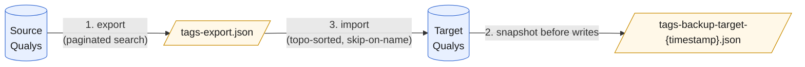

# qualys-utils

[](https://github.com/ciaran-finnegan/qualys-utils/actions/workflows/ci.yml)
[](https://github.com/ciaran-finnegan/qualys-utils/actions/workflows/codeql.yml)
[](https://scorecard.dev/viewer/?uri=github.com/ciaran-finnegan/qualys-utils)
[](LICENSE)

Migrate asset tag configuration between two Qualys subscriptions.

Pulls every tag (name, colour, rule, hierarchy, cloud provider, criticality
score, description) from a **source** subscription via the
[Asset Management & Tagging API v2][api-guide], snapshots the **target**
subscription as a backup, then recreates the source tags on the target —
preserving parent/child relationships and skipping any tag whose name already
exists on the target.

## How it works



## Features

- **Hierarchy preserved** — parents are created on the target before children,
  with `parentTagId` correctly remapped from source ids to target ids.
- **Idempotent re-runs** — tags that already exist on the target (matched by
  name) are skipped with a log line; their existing target id is reused as a
  parent reference for any of their children.
- **Automatic target backup** — before any writes, every tag on the target is
  snapshotted to `tags-backup-target-<timestamp>.json`. The backup uses the
  same JSON schema as `tags-export.json`, so you can roll back by running
  import with the backup file as input.
- **Round-trips all common rule types** — `STATIC`, `NETWORK_RANGE`,
  `NETWORK_RANGE_ENHANCED`, `OS_REGEX`, `CLOUD_ASSET` (with `provider`),
  `ASSET_SEARCH`, `NAME_CONTAINS`, `VULN_EXIST`, `GLOBAL_ASSET_VIEW` (QQL).
- **No external runtime dependencies** — uses Node's built-in `fetch` and
  `--env-file` flag. Only dev-time deps are TypeScript and tsx.

## Requirements

- Node.js ≥ 20.6 (for `--env-file` support)
- A Qualys account on each subscription with permission to:
  - **source**: read asset tags (`Asset Management API`)
  - **target**: read **and** create asset tags

## Install

```sh
git clone https://github.com/ciaran-finnegan/qualys-utils.git
cd qualys-utils
npm install
cp .env.example .env
```

Edit `.env` and fill in the six values. The file is gitignored.

```ini
SOURCE_QUALYS_BASE_URL=https://qualysapi.<your-pod>.apps.qualys.com
SOURCE_QUALYS_USERNAME=...
SOURCE_QUALYS_PASSWORD=...

TARGET_QUALYS_BASE_URL=https://qualysapi.<other-pod>.apps.qualys.com
TARGET_QUALYS_USERNAME=...
TARGET_QUALYS_PASSWORD=...
```

To find your API base URL: log into Qualys → **Help → About** → copy the
"API Server URL" line.

## Usage

### Export tags from source

```sh
npm run export
# default output: tags-export.json
# custom path:    npm run export -- ./snapshots/2026-05-07.json
```

### Import tags to target (with automatic backup)

```sh
npm run import
# reads tags-export.json by default
# writes tags-backup-target-<timestamp>.json before any creates
```

Custom input path:

```sh
npm run import -- ./snapshots/2026-05-07.json
```

### Roll back

To restore the target to its pre-import state, re-run import with the backup
file pointed at the same target. Anything that was added by the import will
be detected as "new" relative to the backup — but since the backup contains
the original tags, the import will skip them (they already exist) and you
just get logging of the diff. To actually delete tags added by a botched
import, do that in the Qualys UI; this tool intentionally does not delete.

## What gets migrated per tag

| Field | Notes |
|---|---|
| `name` | Used as the conflict key on the target. |
| `color` | Passed through verbatim if present. |
| `ruleType` | One of `STATIC`, `NETWORK_RANGE`, `OS_REGEX`, `CLOUD_ASSET`, etc. |
| `ruleText` | The rule body. For `GLOBAL_ASSET_VIEW` this is QQL; for `CLOUD_ASSET` it's the cloud-asset query; for `NETWORK_RANGE_ENHANCED` it's an XML blob. The tool is agnostic — it round-trips whatever Qualys returns. |
| `description` | Free-text description, where present. |
| `criticalityScore` | Integer 1–5 if Qualys has it set. |
| `provider` | e.g. `EC2`, `AZURE`, `GCP` — required for `CLOUD_ASSET` tags. |
| `parentTagId` | Remapped from source id → target id during import. |

What is **not** migrated: source-instance ids (`tagUuid`, `id`,
`parentTagUuid`), `created`/`modified` timestamps, `reEvalStatus`,
`isSubUserScopedTag`, and references to source-instance asset groups or
business units (`srcAssetGroupId`, `srcBusinessUnitId`).

## Development

```sh
npm install
npm run typecheck   # strict TypeScript, no emit
```

The codebase is small on purpose:

```
src/
├── client.ts        # Qualys API client (Basic auth, JSON, pagination)
├── types.ts         # Tag + ServiceRequest/Response shapes
├── export-tags.ts   # CLI: pull from source → JSON
└── import-tags.ts   # CLI: snapshot target, push from JSON
```

See [CONTRIBUTING.md](CONTRIBUTING.md) for contribution guidelines and
[SECURITY.md](SECURITY.md) for how to report vulnerabilities.

## API endpoints used

All from the [Asset Management & Tagging API v2][api-guide]:

| Method | Path | Purpose |
|---|---|---|
| POST | `/qps/rest/2.0/count/am/tag` | Sanity check before paginating |
| POST | `/qps/rest/2.0/search/am/tag` | Paginated tag listing |
| POST | `/qps/rest/2.0/create/am/tag` | Create on target |

Authentication is HTTP Basic with your Qualys username and password — the
same credentials you use to log into the Qualys UI. No API tokens required.

## Security and dependency policy

This repo runs a stack of GitHub-native checks on every push and PR:

| Check | Purpose | Cadence |
|---|---|---|
| CI typecheck | Strict TypeScript compile, blocks merge | Every push + PR |
| CodeQL | Static analysis with `security-extended` queries; results in Code Scanning | Every push + PR + weekly |
| Dependency Review | Blocks PRs that introduce CVE-laden or copyleft-licensed deps | Every PR |
| Secret scanning + push protection | Detects and blocks committed credentials | Every push |
| Dependabot alerts | Flags vulnerable dependencies in main | Continuous |
| Dependabot security updates | Opens PRs to fix vulnerable deps | Continuous |
| Dependabot version updates | Keeps deps current; patch+minor grouped per ecosystem | Weekly (Mondays) |
| OSSF Scorecard | Supply-chain best-practice score, results in Code Scanning | Weekly + on push |

### Auto-merge policy

Dependabot PRs follow this policy via `.github/workflows/dependabot-auto-merge.yml`:

- **Patch + minor** updates → auto-merge after CI typecheck passes.
- **Major** updates → labelled `needs-review,major-version` and left for human review.
- **Security updates** for vulnerable deps inherit the same policy: patch and minor merge automatically once CI is green.

Human-authored PRs require the `typecheck` status check to be green; review is
recommended but not required, since the repo has a single maintainer.

### Reporting a vulnerability

See [SECURITY.md](SECURITY.md) — please report privately via GitHub Security
Advisories rather than opening a public issue.

## License

[MIT](LICENSE) — do what you want, no warranty. Qualys® is a trademark of
Qualys, Inc.; this project is not affiliated with or endorsed by Qualys.

[api-guide]: https://cdn2.qualys.com/docs/qualys-asset-management-tagging-api-v2-user-guide.pdf
